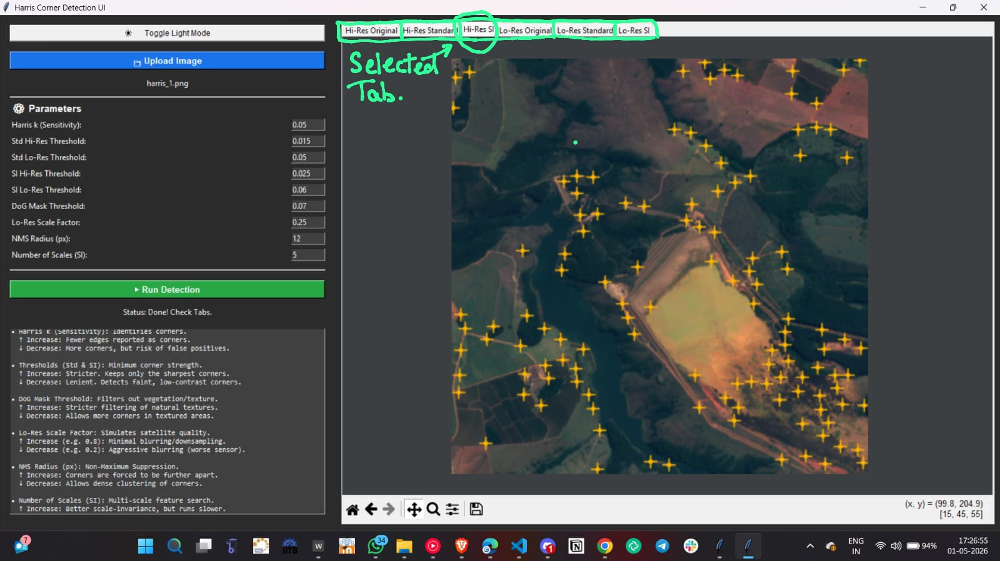

Project submission for GNR602 by: Shresth Keshari(23b2243) and K.HimaVarsha (23b2226)

# 🛰️ Satellite Image Analysis: Harris Corner Detection

This repository contains a standalone desktop application developed for advanced satellite image processing. It acts as a dual-pipeline tool that compares Standard Harris Corner Detection against a custom Scale-Invariant Harris approach (featuring Morphological Gradient Enhancement and DoG Structural Masking) to find robust corners across varying satellite resolutions.

## 🛠️ Dependencies & Installation

If you are running the application from the Python source code, ensure you have Python 3.11 or 3.12 installed. Install the required dependencies using `pip`:

`pip install opencv-python numpy matplotlib`

*(Note: `tkinter` is used for the GUI and is included in the standard Python library).*

### Launching the Executable (`.exe`)
If you have downloaded the packaged `.exe` file from the `dist/` folder, **no installation or Python environment is required.**
1. Navigate to the folder containing the `.exe` file.
2. Double-click the file to launch the application. 
3. *Note: A terminal window will not appear, and the GUI may take 3-5 seconds to initialize on the first launch.*

## 🚀 How to Use
1. Click **📁 Upload Image** and select a satellite image.
2. Adjust the parameters in the left panel (or leave as defaults).
3. Click **▶ Run Detection**.
4. Navigate through the tabs on the right to view, pan, zoom, and save the isolated results for High-Res and Simulated Low-Res outputs.

## 📖 Parameter Guidelines
* **Harris k (Sensitivity):** Usually `0.04 - 0.06`. Higher values result in fewer edges being misclassified as corners.
* **Thresholds (Std & SI):** Determines the minimum corner strength. 
  * *Increase:* Stricter detection; keeps only sharp, high-contrast corners (e.g., bright buildings).
  * *Decrease:* Lenient; catches faint corners (e.g., dirt roads, shaded structures).
* **DoG Mask Threshold:** Filters out natural textures (vegetation/soil). Higher values mean stricter filtering.
* **Lo-Res Scale Factor:** Simulates a lower quality satellite sensor. `0.25` means the image is simulated at 25% of its original resolution.
* **NMS Radius (px):** Non-Maximum Suppression. Forces a minimum pixel distance between detected corners to prevent clustering.
* **Number of Scales (SI):** Controls the depth of the Gaussian pyramid for scale invariance. Higher = more robust, but slower.

---

## 📸 Reference Template: Tested Configurations (original image in: imgs/harris1.png)

*Use this reference chart to find optimal starting parameters based on the type of satellite imagery you are analyzing.*

| Sample Image | Optimal Parameters |
| :--- | :--- |
|  | **Harris k:** `0.05` **Std Hi-Res Threshold:** `0.015` **Std Lo-Res Threshold:** `0.05` (Strict) **SI Hi-Res Threshold:** `0.06` **SI Lo-Res Threshold:** `0.07`  **Lo-Res Scale Factor:** `0.25`  **NMS Radius:** `12` **Number of Scales:** `5`|
